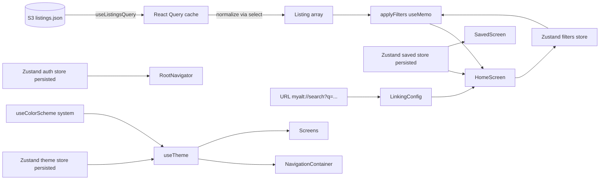

# AltLite

An Alt-lite sports-card marketplace app built with bare React Native CLI + TypeScript. Submitted as a take-home.

> This repo satisfies the required feature set (Home + Profile tabs, saved listings, search & filter, password auth with **in-app password change**, scheme-based deep links for `/search`, `/saved`, and `/listing/:id`) and adds a memoization-disciplined `FlatList` (list + grid), light / dark / system theming, a typed navigation graph, and a themed vector-icon primitive.
>
> **AI configs ship inside the submission.** The `.cursor/rules/` (8 `.mdc` files) and `.cursor/skills/` (5 `SKILL.md` files) folders at the repo root are the AI configs used during this build — they are tracked in git and included in any ZIP download, per the prompt's "AI skills, readmes, or configs" requirement. See Section 6 for details.

---

## 1. How to run

### Prerequisites

- Node.js **20.19+** (22+ recommended — matches the RN 0.85 template; 20.19 builds with a soft warning)
- Ruby + CocoaPods for iOS (only once on first setup)
- Xcode 15+ and / or Android Studio with an emulator

### Install

```bash
cd AltLite
npm install --legacy-peer-deps
```

> First launch lands on the **Login** screen — auth is gated and there are no seeded credentials. Tap **Register** to create an account (stored locally on-device), then sign in.

### iOS

```bash
cd ios && pod install && cd ..
npm run start
npm run ios
```

### Android

Start an Android emulator first (Android Studio → Device Manager → Play), then:

```bash
npm run start
npm run android
```

### Other scripts


| Script              | What it does                                 |
| ------------------- | -------------------------------------------- |
| `npm run start`     | Metro bundler                                |
| `npm run test`      | Jest (pure-logic + store tests, 26 cases)    |
| `npm run lint`      | ESLint over `.ts` / `.tsx`                   |
| `npm run typecheck` | `tsc --noEmit` against the strict `tsconfig` |


---

## 2. Deep link testing

The app registers the `myalt://` URL scheme on both platforms. Links are gated by auth; arriving while logged out stashes the URL and replays it via `Linking.openURL(...)` after successful sign-in.

### Supported URLs


| URL                                                                            | Behavior                                         |
| ------------------------------------------------------------------------------ | ------------------------------------------------ |
| `myalt://search`                                                               | Opens Home with default filters                  |
| `myalt://search?q=mahomes&category=FOOTBALL_CARDS&minPrice=100&sort=price-asc` | Opens Home and applies the parsed filters        |
| `myalt://saved`                                                                | Opens the Profile tab → Saved listings           |
| `myalt://listing/:id`                                                          | Opens the listing detail screen for the given id |


### Test commands

iOS simulator (must have a booted device):

```bash
xcrun simctl openurl booted "myalt://search?q=mahomes&category=FOOTBALL_CARDS&minPrice=100"
xcrun simctl openurl booted "myalt://saved"
```

Android emulator:

```bash
adb shell am start -W -a android.intent.action.VIEW -d "myalt://saved"
adb shell am start -W -a android.intent.action.VIEW -d "myalt://search?q=mahomes&category=FOOTBALL_CARDS&minPrice=100"
```

---

## 3. Architecture

### Data flow




### Folder layout (feature-first)

```
AltLite/
├── App.tsx                         # QueryClientProvider + NavigationContainer
├── src/
│   ├── app/                        # navigators, linking, nav theme, pending link store
│   ├── api/                        # fetch wrapper + listings endpoint (single swap point for a real backend)
│   ├── components/                 # shared primitives (Button, Input, Chip, Icon, PriceTag,
│   │                               #   EmptyState, Skeleton, ComingSoonOverlay, SplashScreen)
│   ├── features/
│   │   ├── auth/                   # zustand store + hashing + RHF/zod screens
│   │   ├── listings/               # types, normalize, filter, queries, filter store, components, screens
│   │   ├── saved/                  # persisted Set<id> + Saved components + SavedScreen
│   │   ├── profile/                # profile screens (logout / edit)
│   │   └── theme/                  # palettes, tokens, useTheme, toggle, appearance picker
│   ├── hooks/                      # useDebouncedValue, useImagePrefetch
│   ├── types/                      # ambient module declarations
│   └── utils/                      # formatters
├── .cursor/
│   ├── rules/                      # 8 auto-applied rule files (RN, TS, RQ, zustand, navigation,
│   │                               #   memoization, theming, performance)
│   └── skills/                     # 5 discoverable skill files (frontend, backend, react,
│                                   #   react-native, git)
├── __tests__/                      # Jest (pure logic + store)
└── __mocks__/                      # AsyncStorage mock for unit tests
```

Features are colocated: a feature owns its store, its components, and its screens. Pure logic (`normalize.ts`, `filter.ts`, `hash.ts`, `deepLinkFilters.ts`) is isolated to keep tests trivial. The only shared surface across features is `src/components` (theme-aware primitives).

### Memoization strategy (where perf lives or dies)

- `ListingCard` / `ListingTileCard` → `React.memo` with custom equality comparing `listing` reference and `onPressId` reference; primitive-only props; internal `useIsSaved(id)` selector means a save toggle re-renders only the one row/tile.
- `ListingList` → `React.memo`, `renderItem`/`keyExtractor` via `useCallback`, `getItemLayout` wired on **both** the list branch (fixed `CARD_HEIGHT`) and the 2-column grid branch (computed from the current `useWindowDimensions()` width and the tile body height), plus tuned `windowSize` / `initialNumToRender` / `removeClippedSubviews`.
- `HomeScreen` → `applyFilters(listings, filters)` inside `useMemo(..., [data, filters])`.
- Search input is debounced 250 ms via `useDebouncedValue` before it's pushed into the filters store — typing does not refilter on every keystroke.
- Theme-dependent styles live behind `useMemo(() => makeStyles(theme), [theme])`; the `NavigationContainer` theme object is memoized too, so identity only changes when the resolved mode flips.
- React Query `select: normalizeListings` memoizes the normalized array per subscriber.
- `SavedScreen` calls `useImagePrefetch(topSavedImageUrls, 12)` on mount so the first-12 images are already in the native image cache before the user scrolls, eliminating the usual blank-thumbnail flash on re-open.

---

## 4. Major decisions and tradeoffs

- **Bare RN CLI over Expo.** Matches typical production mobile repos; full native control of `Info.plist` / `AndroidManifest.xml` for deep links.
- **Zustand + React Query over Redux Toolkit.** Zero boilerplate, idiomatic selectors, `persist` middleware handles AsyncStorage. React Query owns the network cache (normalization via `select`, 10-minute `staleTime`).
- **Feature-folder layout.** Features outlive screens; `ListingCard` is reused across Home and Saved. Pure-logic modules are unit-tested.
- **Local auth with `js-sha256` + random salt + pepper, iterated 10,000 times.** The plan pointed at `scrypt-js` for better resistance, but `js-sha256` is lighter and the iteration loop still frustrates trivial offline attacks on AsyncStorage. `api/client.ts` already returns API-shaped JSON so swapping to a real `/auth/login` endpoint is a one-file change.
- **In-app account management on `EditProfileScreen`.** Two zod-validated forms stacked on one screen: a **profile form** (display name + email, `profileUpdateSchema`) and a **password-change form** (current / new / confirm with show-hide toggles, `passwordChangeSchema`). Both dispatch to `useAuthStore.updateProfile` / `useAuthStore.changePassword` respectively, with the current-password re-hash check on the store side. Reachable from Profile → "Edit account".
- **Discriminated union for `Listing` (`FIXED_PRICE | AUCTION`).** Normalization merges the two S3 arrays into one renderable shape; `listingPrice(l)` is the single cross-kind accessor.
- **Deep links as `route.params → filters store`.** UI state and URL state share one source of truth; the parser sanitizes params with zod before replacing filters.
- **Light / dark / system theming.** `useTheme()` resolves store mode + `useColorScheme()`; `NavigationContainer theme`, `StatusBar barStyle`, and every primitive are wired through a single object. Toggle icon lives on Home; three-way picker in Profile.
- **Ionicons via `react-native-vector-icons`.** Native-linked on both platforms (iOS `UIAppFonts` in `Info.plist`, selective Gradle copy on Android so only `Ionicons.ttf` ships instead of the full vector-icons bundle). Wrapped in a theme-aware `<Icon>` primitive (`src/components/Icon.tsx`) with a typed `IconName` whitelist — the icon set is one import away from swap.
- **Native `Modal` for FilterSheet instead of `@gorhom/bottom-sheet`.** Bottom-sheet brings `react-native-reanimated` native linking. Modal ships the same UX (slide-up, backdrop, draggable handle visual) without the build complexity.
- **Strict TypeScript** (`strict`, `noUncheckedIndexedAccess`, `noImplicitOverride`) + ESLint with `react-hooks`, `react-native`, `react-perf`, `@typescript-eslint`, `import`. The `react-perf` rules mechanically enforce the "no inline object/array/function props across memo boundaries" guidance from the plan.

---

## 5. What I'd add with more time

- **Biometric unlock** + `react-native-keychain`-backed refresh tokens (today the session is an AsyncStorage-persisted user id).
- **Detox or Maestro E2E** covering the auth flow, deep-link flow, and save toggle.
- **Observability**: Sentry + React Query devtools.
- **OpenAPI codegen** for `api/client.ts` once a real endpoint exists.
- **Pagination / infinite scroll** via `useInfiniteQuery` (the list already accepts a pre-sliced array so this is isolated).
- **Image caching & resizing** via `react-native-fast-image` with `cache: 'immutable'` once New Architecture support stabilizes on RN 0.85.
- **i18n** via `i18next`, especially for the category labels currently humanized in `utils/formatters.ts`.
- **Husky + lint-staged** pre-commit hook (config is 15 lines, left out to keep the repo flat).
- **Profile avatar upload** + local image store.

---

## 6. AI technologies used

- **Cursor in Plan mode** — produced a detailed execution plan (two variants: comprehensive vs. slim), compared it against the prompt, and iterated theming + linting + performance sections before any code was written. The approved plan became the source of truth during execution; its decisions/tradeoffs live in Section 4 of this README.
- **Cursor Rules** (`.cursor/rules/*.mdc`) — eight short, focused rule files auto-applied by glob: `react-native`, `typescript`, `react-query`, `zustand`, `navigation`, `memoization`, `theming`, `performance`. Authored up-front via the `create-rule` skill so the agent stayed consistent across sessions (selectors-only zustand, discriminated unions, `getItemLayout` on `FlatList`, debounced search, etc.).
- **Cursor Skills** (`.cursor/skills/*/SKILL.md`) — five discoverable skill files: `frontend`, `backend`, `react`, `react-native`, `git`. Rules are *constraints* that auto-apply; skills are *workflows* the agent reads when a relevant topic surfaces in conversation (e.g. opens `react-native/SKILL.md` when asked to debug a native-module build error). Authored via the `create-skill` skill.
- **Cursor in Agent mode** — drove the actual implementation: scaffolded the RN CLI app, wired navigators, authored stores, built UI, and ran `tsc` + `jest` as a tight loop. Todos were tracked with the agent's todo tool so no part of the plan was skipped.
- **Zod at all trust boundaries** — form inputs (login / register / profile) and deep-link `route.params`. AI-driven prompts explicitly demanded validation here rather than trusting JS coercion.
- **README itself** was co-drafted with the agent against the plan's decisions/tradeoffs list to keep this document and the code in sync.

---

## 7. Test coverage snapshot

`npm run test` — **26 tests, 6 suites, all green**:

- `normalize.test.ts` — FIXED_PRICE vs AUCTION discrimination, image fallback, id-guard.
- `filter.test.ts` — query/category/price-range/kind filtering + all three sort keys.
- `hash.test.ts` — deterministic hashing, salt differentiation, verify correctness.
- `useTheme.test.ts` — `resolveMode` over all mode × system-scheme combinations.
- `deepLinkFilters.test.ts` — param parsing + invalid-value fallback + `countActiveFilters`.
- `savedStore.test.ts` — toggle / independence of multiple ids.

